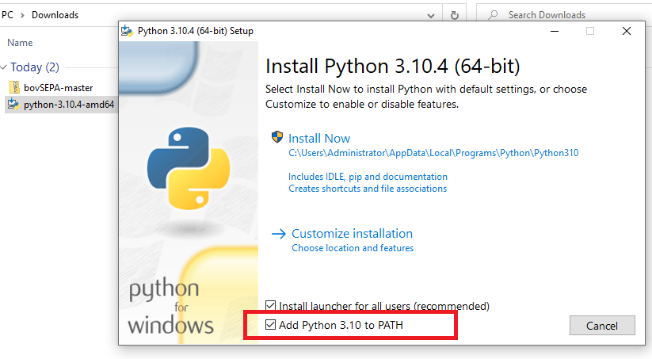

Installing bovSEPA on your computer
===================================

`This document is shows you how to install bovSEPA for the Windows x64 platform. It should work with other OSs`  

To install bovSEPA you need to:

  1. Install Python v3.x
  2. Install Microsoft C++ Build Tools
  3. Download bovSEPA
  4. Download additional modules that are required to run the solution

Install Python v3.x
-------------------

.

Go to the [Python Website](https://www.python.org) and from the Download tab select the latest version of Python for your platform.

.

Click the installer. Before selecting the **Install Now** option check the *Add Python 3.x to PATH*.  This will avoid you having to type the path to the Python interpreter in order to execute the program.

Install Microsoft C++ Build Tools
---------------------------------

.

Go to the [Microsoft C++ Build Tools page](https://visualstudio.microsoft.com/visual-cpp-build-tools/) and download the installer.

.

Execute the installer and check the option **Desktop Development with C++**.   
Click install.  

.

Once the selected options have been installed exit.

Download bovSEPA
----------------

