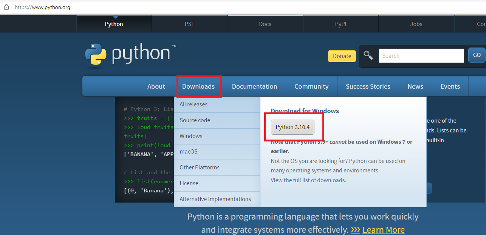
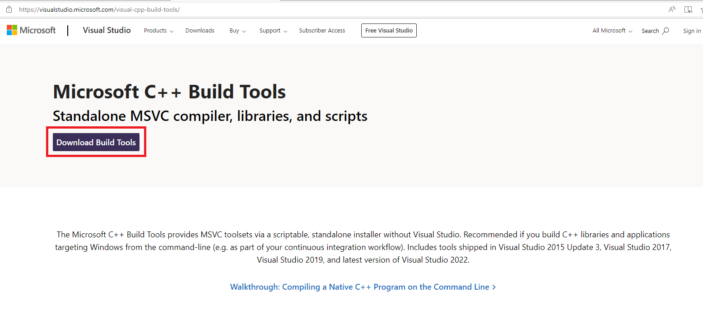
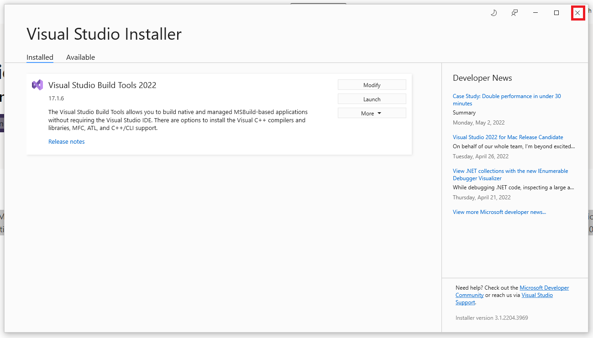
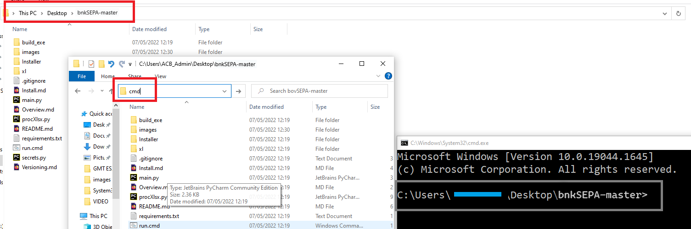
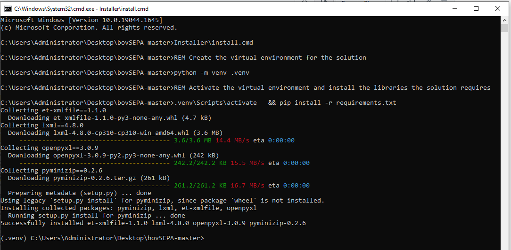
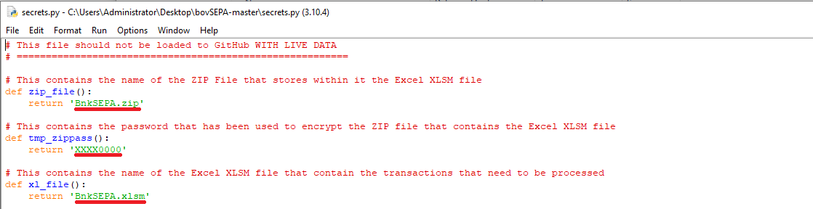
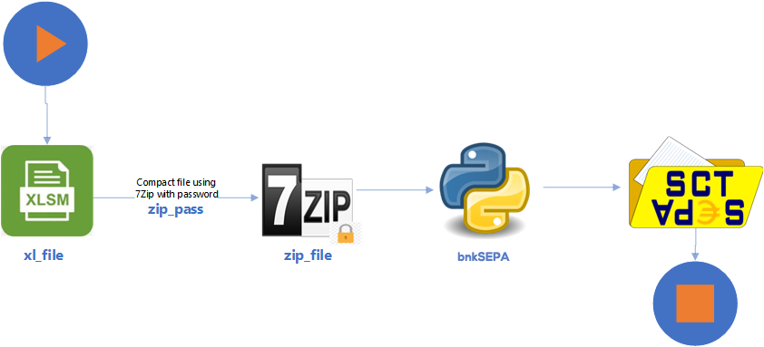

Installing bovSEPA on your computer
===================================

`This document is shows you how to install bovSEPA for the Windows x64 platform. It should work with other OSs`  

To install bovSEPA you need to:

  1. [Install Python v3.x](#Python)
  2. [Install Microsoft C++ Build Tools](#MSBldTools)
  3. [Download bovSEPA](#DLbovSEPA)
  4. [Download 7Zip](#7Zip)
  5. [Download support modules](#DLModules)
  6. [Configure your settings](#UserConfig)
  7. Help the **bovSEPA** project with a couple of clicks.

Install Python v3.x
-------------------

.

Go to the [Python Website](https://www.python.org) and from the Download tab select the latest version of Python for your platform.

.

Click the installer. Before selecting the **Install Now** option, check the *Add Python 3.x to PATH*.  This will avoid you having to type the path to the Python interpreter in order to execute the program.

Install Microsoft C++ Build Tools
---------------------------------

.

Go to the [Microsoft C++ Build Tools page](https://visualstudio.microsoft.com/visual-cpp-build-tools/) and download the installer.

.

Execute the installer and check the option **Desktop Development with C++**.   
Click install.  

.

Once the selected options have been installed exit.

Install 7-Zip
---------------------------------

Part of the process of generating the SCTE file requires that you zip the XLSM file.

While there are a number of programs that generate zip file, 7Zip is the one that has been tested with this solution.

7-Zip is free software with open source and can be downloaded from [the 7-Zip web site](https://www.7-zip.org).

Download bovSEPA
----------------

.

Go to the [bovSEPA GitHub repository](https://www.github.com/chribonn/bovSEPA).

Click the Watch option on the page. You will be asked to register with GitHub.  *Registration is Free*.

>> The Watch option will inform you whenever bovSEPA is enhanced and improved with new features.

>> Registering also allows you to contribute the the project and request new options.

Click the **Starred** option to help spread the word about this project.

.

Click the **Code** button and select the option **Download ZIP**. This will save the program to your computer.

*This tutorial will install the solution on the computer desktop.*

.

In *File Explorer* right click on the zip archive and select the option **Extract All...**.

.

### READ CAREFULLY

If you accept the directory suggested by the **Extract All...** option the code will be extracted into `Desktop ==> bovSEPA ==> bovSEPA`.

Backspace as shown above to get the installation to be at `Desktop ==> bovSEPA`

Click the **Extact** button.

Download support modules
----------------

.

1. Click on the bovSEPA folder to open it.
2. Type **cmd** in the address bar.
3. This will cause a command window to open. The prompt should end with the bovSEPA folder name.

.

1. Type **Installer\install.cmd** and press enter. The environment and the modules this solution uses will be setup and installed.
2. Type Close the command prompt window.

Configure your settings
----------------

## Configure the *secrets.py* file

.

Right click on **secrets.py** file and choose *Edit with IDLE*. (You can also edit the file with a text editor such as *Notepad*).

.

There are 4 settings you can edit in **secrets.py**:

  * **zip_file** - name of the zip file you will use to zip the XL workbook with your transactions.
  * **zip_pass** - password you will use when archving the file
  * **xl_file** - name of the XL file with your transactions
  * **bank_scte** - **This is the password that is shared with your bank**

.

