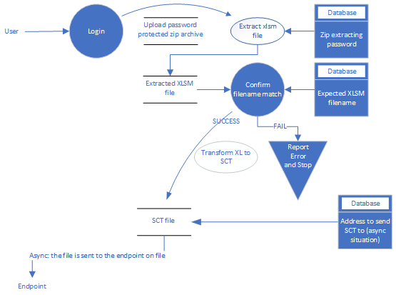

# Embedding the solution into a portal

The design of this solution was built so that it could form part of a client facing portal with this being one of the options.

1. The user would log into a portal using their credentials.
2. After they are validated the user would upload the zip file to the portal for processing.
3. Associated with the portal would the the password the zip file (**zippass**) is encrypted with. This could be altered by the user.
4. The conversion engine would unzip the encrypted file, process it and encrypt the output with the password agreed with the bank (**bankSCTE**).
5. Once the SCTE file is ready, the solution:
    - transmit the file to the financial institution directly 
    - allow the user to download the file to perform the transmission part themselves.
    
The system could be designed in such a way that the bank-agreed password would be known to a different subset of persons than those processing the file. This would allow for a segregation of duties. This constitutes a security measure that ensure that no one individual has enough information or access privilege to perpetrate damaging fraud.

