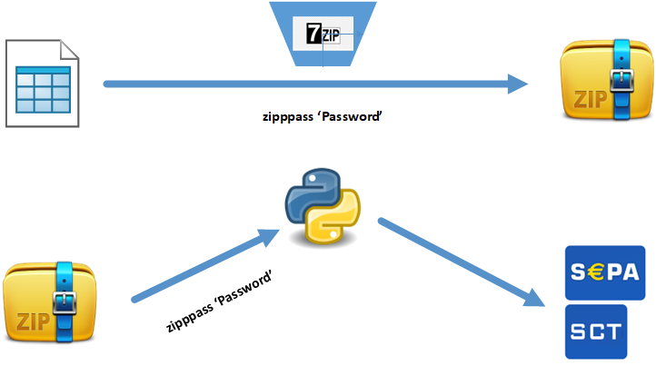

# bnkSEPA file creator

#### Last update: 202204
#### Version - 1.35.00
#### Project Repository: https://www.github.com/chribonn/bnkSEPA

## Project Overview

This is an engine written in Python that takes a Microsoft Excel spreadsheet and converts into a password protected file that will be processed by Bank of Valletta (BOV).  Other financial institutions that use the same format may also benefit from this **ETL** (*Extract Transform Load*) engine.

The Excel workbook consists of the following worksheets:
  * Payment Information Record - This sheet holds information of the payee account. This will be entity that will upload the file to the bank
  * Credit Instruction Record - This sheet contains the transactions that are to be processed. The maximum number of transactions can be increased (this has already happened). An increase in the number of transactions will require changes to both the Excel and the Python code.
  * Control - This worksheet performs the following functions:
    - It stores within it the password provided by the bank to encrypt the transmission
    - It stores the filename that will be used to package the transmission
    - It provides a summary of the posting for control / checking purposes
  * Client Payee Data. This worksheet is not an integral part of the solution.  When populated it allows the person filling in the *Credit Instruction Record* to use the Excel VLOOKUP function to copy the payee details thereby avoiding the need to manually type them in.  The assumption is that this worksheet is populated from another system. VLOOKUP search is on the account number.
  * Control Data (Hidden) - This worksheet consists of:
    - Versioning information
    - Author information
    - The source documentation this solution was based upon
    - The drop down lists used in some of the other worksheets

## Solution Flow Diagram

When the Excel file is ready to be processed it must be zipped using 7Zip with a password. The resulting password protected zip file will then need to be processed by the python engine so as to produce the SCTE file required by the bank. This file is protected by a password that has been agreed with the financial institution.

The python engine takes the following arguments:

  * --zipname - this is the name of the archive that contains the archived Excel.  [*Mandatory*]
  * --zippath - this is the directory where the zip file is located. [Default: *directory used for temporary files*]
  * --zippass - the password of the zip file [Default: *string returned by function tmp_zippass() in secrets.py*]
  * --bankSCTE - the password to archive the SCT file for the bank [Default: *string returned by function bnk_scte() in secrets.py*]

## Macros

This Microsoft Excel workbook makes use of macros to perform some of the functions is does.  When opening the downloaded file for the first time macros must be enabled in order to benefit fully from the solution. Keeping macros disabled will still generate the output for the bank; it will impact of the functionality available within Excel.

The following VBA modules are defined:
  * Sheet: *Credit Instruction Record*
    - VBA Macro **ClearSheet** - This goes through all the rows in the sheet and blanks them out.
  * Sheet: *Control*
    - VBA Macro **Worksheet_Activate** - When the worksheet control is activated the associated pivot table is updated.

## Documentation and Notes in the XL folder

The folder **XL** consists of the following files:
  * **BnkSEPA.xlsm** - This is the file that will be used to post the transactions and which will be used to generate the file used as input for the ETL transformation
  * **Backup of BnkSEPA.xlk** - Backup of BnkSEPA.xlsm (just in case)
  * **SEPA SCT File Layouts.pdf** - This is the document on which the solution was based upon
  * **SEPA Notes.txt** - These are additional information made available by the bank.
  
## Checking and Validation

Input validation is done both at the input stage and while the Excel file is being processed.  The posting agents can then take the necessary action to correct the error.  

The Python conversions script operates on an all-or-nothing methodology.  This means that upon an error occurs in one row all processing stops.

## Password

The solution makes use of the following passwords:
  * Excel Workbook / Worksheet Password
    - Password: *Uneaten-6Unstirred*
      - This password is used to protect the Workbook / Worksheets and in the VBA Macro **Worksheet_Activate**.
      - Many cells in the various Worksheets are locked thereby preventing the users from typing into cells they should not or changing cells that should not be changed.
  * Zip Password
    - This password can be passed as parameter to the python script. It defaults to the string returned by the function **tmp_zippass()** in the module **secrets.py**. 
    - This password is used to archive the Excel Workbook 
  * SCTE Password
    - The file that is transmitted to the bank needs to be password protected. This password can be passed as parameter to the python script. It defaults to the string returned by the function **bnk_scte()** in the module **secrets.py**. 

