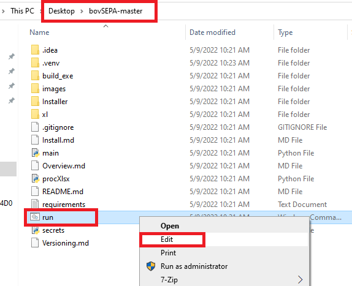
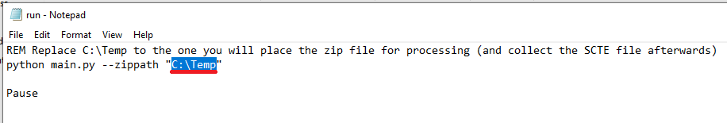
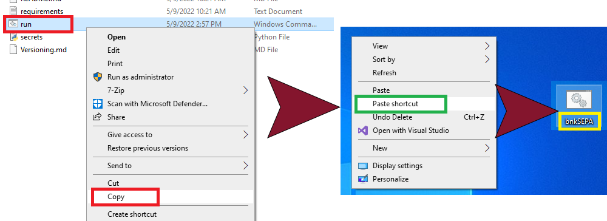
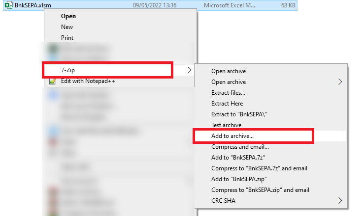
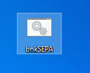

Running bnkSEPA on your computer
================================

`This document walks you through the process of running bnkSEPA.`

## First time setup

### Setting up the XL Workbook

1. You should copy the BnkSEPA.xlsm file from the project's xl directory to a folder you will work from. For the purposes of this tutorial the folder will be called **bnkSEPA**.
2. Open the xlsm file and accept security warnings if you want to be able to use automation functions built into the XL workbook (*bnkSEPA will still work if macros are disabled*).
3. The XL workbook is password protected to limit typing only in certain cells thereby limiting entry errors. The password is *Uneaten-6Unstirred*.
4. You may want to change the default password. To change the password, unprotect the workbook and worksheets using the default one and protect everything again using the one of your choice.
5. Go to **Payment Information Record** sheet and fill in your SEPA Payee details.
6. (*Optionally* ) Go to the **Client Payee Data** tab and fill in the list of payees you make regular payments to.
7. Save this workbook and keep a backup.

### Setting up the processing directory

bnkSEPA will look for the ZIP file and deposit the SCTE file in a directory on your computer. The location of this directory is defined in the file **run.cmd**.

Edit the file **run.cmd** in the project's xl directory with a text editor such as *Notepad*.

.

By default the bnkSEPA engine expects the files to reside in *C:\Temp*. If you case is different, edit this to correct directory.  

.

### Placing s shortcut of bnkSEPA on the desktop

In order to make it easy to run the bnkSEPA, a shortcut to the file **run.cmd** can be placed on the desktop for easy access. 

.

1. In File explorer right click on **run.cmd** and choose the option *Copy* from the shortcut menu.
2. Right click anywhere on the desktop, right click and choose the option *Past shortcut* from the shortcut menu.
3. Right click on the icon and choose the *Rename* option to change its name to bnkSEPA.

## Run Phase

### Entering Transactions

Every time you need to make a batch payment:

1. Make a copy of the XL workbook you set up with your payee details. (A macro to clear the details already exists under the **Credit Instruction Record** sheet but is not yet accessible).
2. Enter the payee transactions in the **Credit Instruction Record** tab.
3. You can get a breakdown of the batch payments in the **Control** tab (*only works if macros are enabled*).
4. Save the workbook. By default a backup of the workbook as it was originally will be made. This will allow you to revert to the earlier version.

### Creating the ZIP file

1. Use 7-Zip to archive the XLSM file to the password protected zip format.
  - Right click on the XLSM file and from the shortcut menu choose the option **Add to archive...** from the *7-Zip* option.

.

  - Fill in the details to match the **secrets.py** file.

### Double click the icon

.

Double click the bnkSEPA icon and wait for the file to process the transactions.

Once this is done, collect the **SCTE** file from the processing directory and forward it to the bank.

