Install bnkSEPA on your computer
================================

`This document is shows you how to install bnkSEPA for the Windows x64 platform. It should work with other OSs`  

To install bnkSEPA you need to:

- [Install bnkSEPA on your computer](#install-bnksepa-on-your-computer)
  - [Install Python v3.x](#install-python-v3x)
  - [Install Microsoft C++ Build Tools](#install-microsoft-c-build-tools)
  - [Install 7-Zip](#install-7-zip)
  - [Download bnkSEPA](#download-bnksepa)
    - [READ CAREFULLY](#read-carefully)
  - [Download support modules](#download-support-modules)
  - [Configure your settings](#configure-your-settings)
  - [Configure the *secrets.py* file](#configure-the-secretspy-file)

Install Python v3.x
-------------------

.

Go to the [Python Website](https://www.python.org) and from the Download tab select the latest version of Python for your platform.

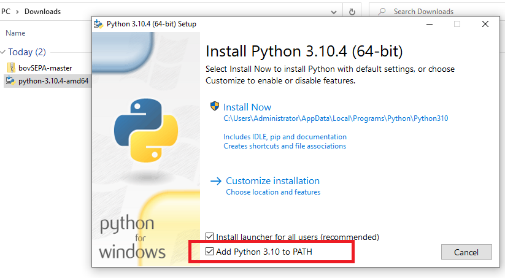.

Click the installer. Before selecting the **Install Now** option, check the *Add Python 3.x to PATH*.  This will avoid you having to type the path to the Python interpreter in order to execute the program.

Install Microsoft C++ Build Tools
---------------------------------

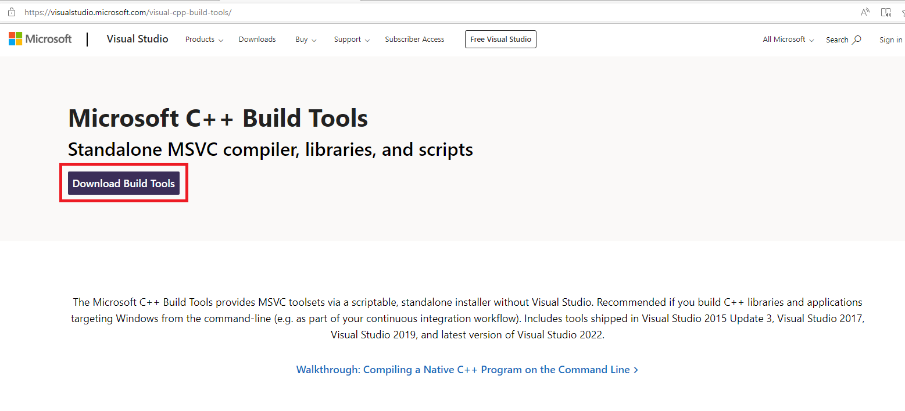.

Go to the [Microsoft C++ Build Tools page](https://visualstudio.microsoft.com/visual-cpp-build-tools/) and download the installer.

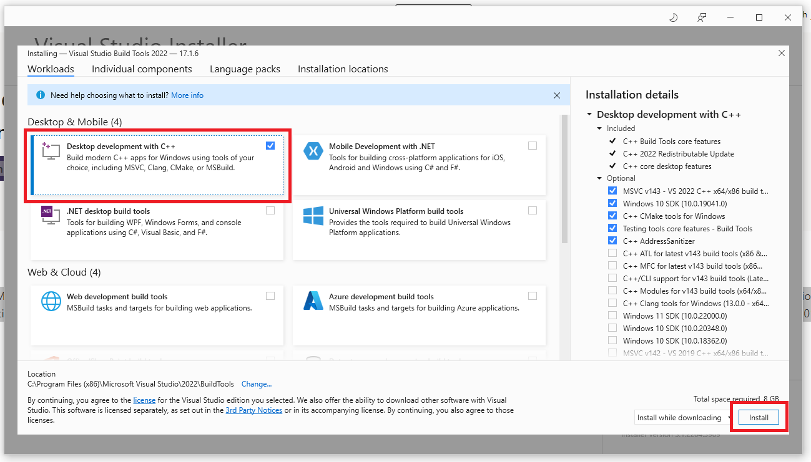.

Execute the installer and check the option **Desktop Development with C++**.   
Click install.  

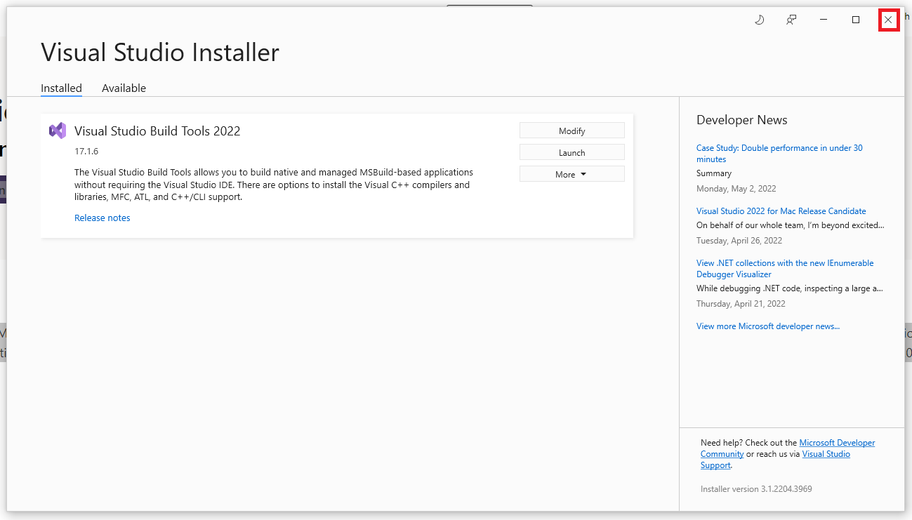.

Once the selected options have been installed exit.

Install 7-Zip
---------------------------------

Part of the process of generating the SCT file requires that you zip the XLSM file.

While there are a number of programs that generate zip file, 7Zip is the one that has been tested with this solution.

7-Zip is free software with open source and can be downloaded from [the 7-Zip web site](https://www.7-zip.org).

Download bnkSEPA
----------------

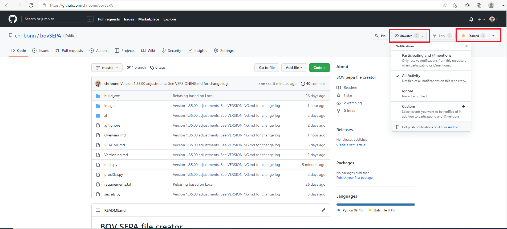.

Go to the [bnkSEPA GitHub repository](https://www.github.com/chribonn/bnkSEPA).

Click the Watch option on the page. You will be asked to register with GitHub.  *Registration is Free*.

>> The Watch option will inform you whenever bnkSEPA is enhanced and improved with new features.

>> Registering also allows you to contribute the the project and request new options.

Click the **Starred** option to help spread the word about this project.

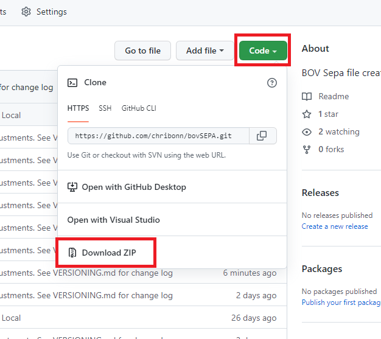.

Click the **Code** button and select the option **Download ZIP**. This will save the program to your computer.

*This tutorial will install the solution on the computer desktop.*

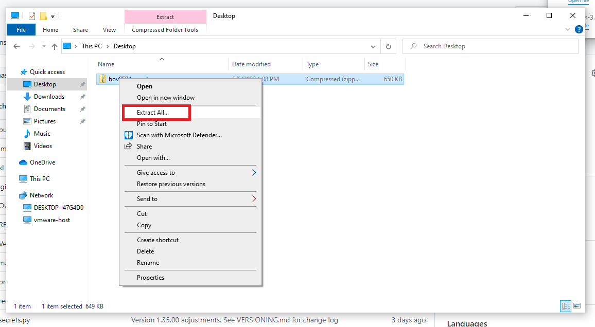.

In *File Explorer* right click on the zip archive and select the option **Extract All...**.

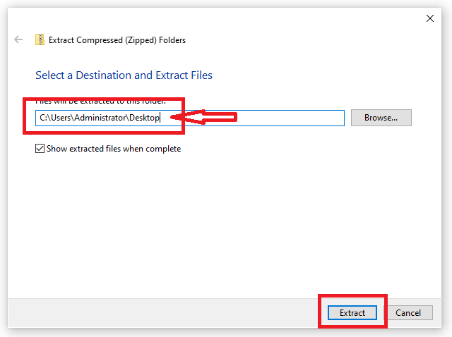.

### READ CAREFULLY

If you accept the directory suggested by the **Extract All...** option the code will be extracted into `Desktop ==> bnkSEPA ==> bnkSEPA`.

Backspace as shown above to get the installation to be at `Desktop ==> bnkSEPA`

Click the **Extact** button.

Download support modules
----------------

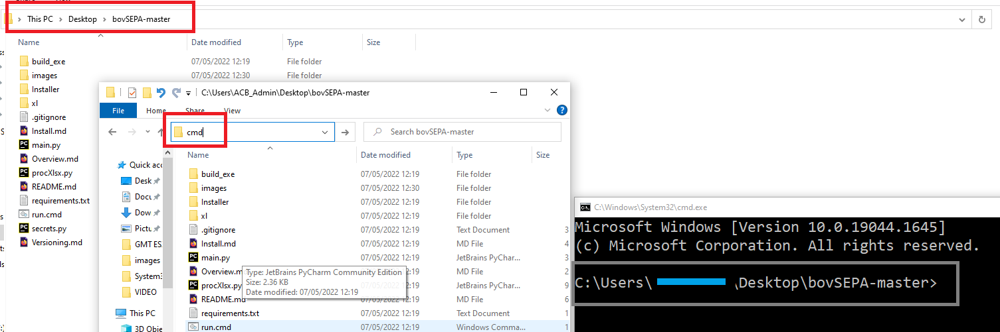.

1. Click on the bnkSEPA folder to open it.
2. Type **cmd** in the address bar.
3. This will cause a command window to open. The prompt should end with the bnkSEPA folder name.

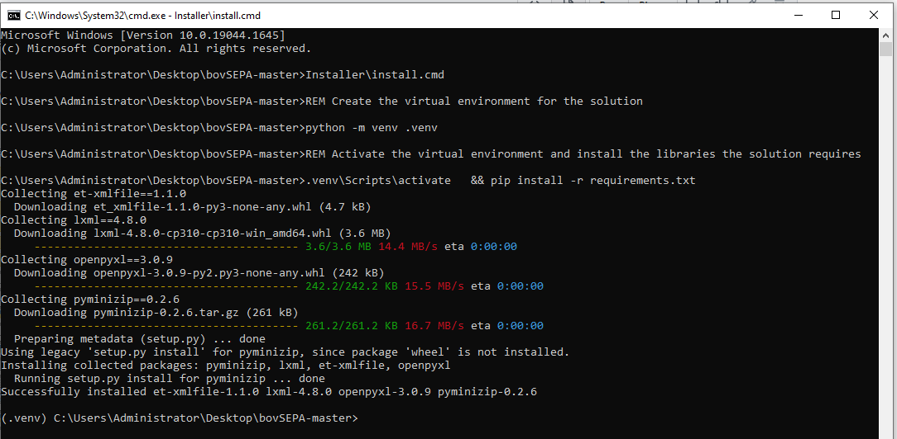.

1. Type **Installer\install.cmd** and press enter. The environment and the modules this solution uses will be setup and installed.
2. Type Close the command prompt window.

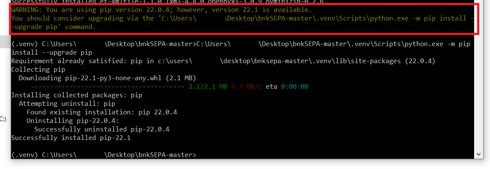

If prompted to update any components, copy the command into the command window.

Configure your settings
----------------

## Configure the *secrets.py* file

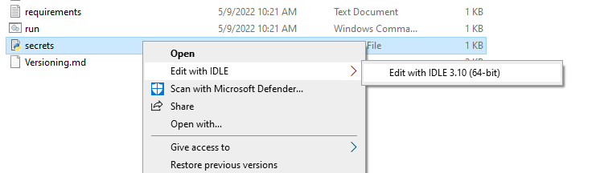.

Right click on **secrets.py** file and choose *Edit with IDLE*. (You can also edit the file with a text editor such as *Notepad*).

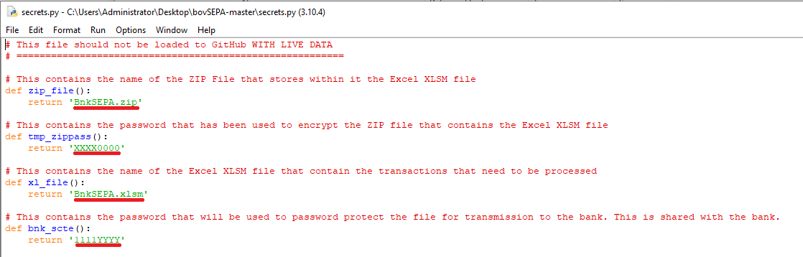.

There are 4 settings you can edit in **secrets.py**:

  * **zip_file** - name of the zip file you will use to zip the XL workbook with your transactions.
  * **zip_pass** - password you will use when archving the file
  * **xl_file** - name of the XL file with your transactions

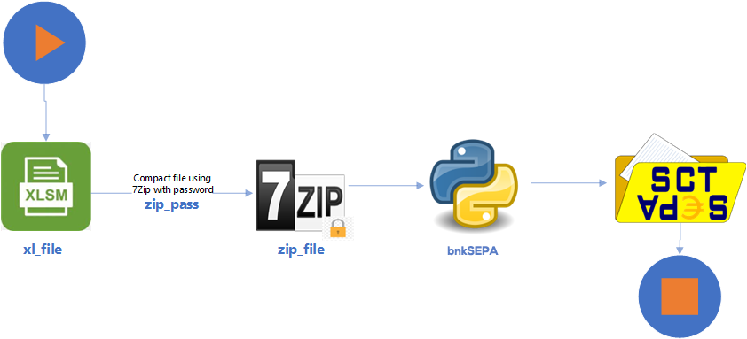.

## YouTube Video

[][https://www.youtube.com/watch?v=x1cGcz2AZdQ)
